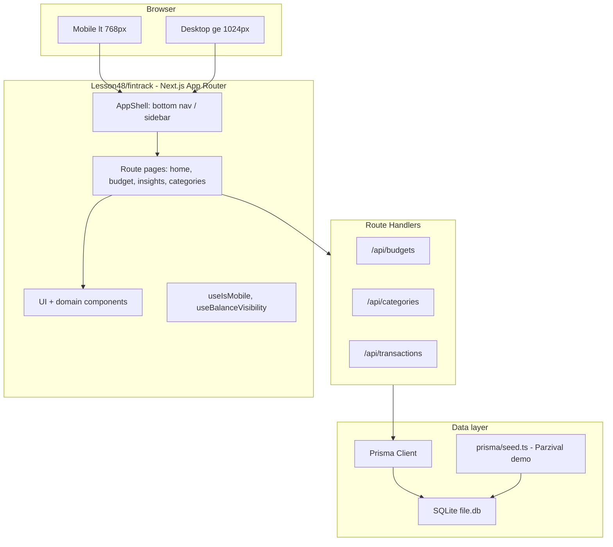

# Fintrack MVP project setup (Lesson48)

## Goal

Create a production-ready **scaffold** at [`Lesson48/fintrack/`](Lesson48/fintrack/) — not feature-complete UI, but all dependencies, tooling, folder structure, design tokens, Prisma schema, seed data, route stubs, and docs so the team can implement PRD epics A–G without rework.

**Reference:** [`Lesson48/docs/prd.md`](Lesson48/docs/prd.md) (responsive web, SQLite confirmed).

**Convention source:** [`Lesson46/ecom-130625/`](Lesson46/ecom-130625/) (Next 16, React 19, Tailwind 4, shadcn, Prisma, Jest, Playwright).

---

## Architecture



**Auth decision (MVP):** No Auth0 — PRD has no login screens. Single demo user **Parzival** seeded in SQLite; `lib/session.ts` returns demo user ID. Auth deferred to Phase 1.

---

## Step 1 — Bootstrap Next.js app

Create app inside [`Lesson48/fintrack/`](Lesson48/fintrack/):

```bash
cd Lesson48
npx create-next-app@latest fintrack --typescript --tailwind --eslint --app --src-dir=false --import-alias "@/*"
```

Pin versions to match course (from [`Lesson46/ecom-130625/package.json`](Lesson46/ecom-130625/package.json)):
- `next@^16.2.x`, `react@19.2.x`, `react-dom@19.2.x`
- `tailwindcss@^4`, `@tailwindcss/postcss@^4`
- Dev port **4010** (avoid collision with ecom on 4005): `"dev": "next dev -p 4010"`

Add [`AGENTS.md`](Lesson48/fintrack/AGENTS.md) + [`CLAUDE.md`](Lesson48/fintrack/CLAUDE.md) mirroring Lesson46.

---

## Step 2 — Install dependencies (mapped to PRD)

### Core runtime

| Package | PRD / engineering need |
|---------|------------------------|
| `prisma`, `@prisma/client` | Data model §10.1 |
| `zod` | API + form validation (budget sum = total) |
| `date-fns` | Month selector (Epic C4) |
| `recharts` | Donut/ring spending chart (Epic C1–C2) |
| `lucide-react` | Icons (Figma uses vuesax-style icons) |
| `clsx`, `tailwind-merge`, `class-variance-authority` | shadcn utility pattern |
| `radix-ui` / `shadcn` CLI | Accessible dialogs, sheets, tabs (Epic F4) |

### Dev / quality (PRD §11, DoD)

| Package | Purpose |
|---------|---------|
| `@playwright/test` | E2E at 375 / 1280 px (US-000) |
| `jest`, `jest-environment-jsdom` | Unit tests for budget math |
| `@testing-library/react`, `@testing-library/jest-dom` | Component tests |
| `ts-node` | Prisma seed script |
| `dotenv` | Local env loading |

**Not installing for MVP scaffold:** Auth0, Stripe, MongoDB driver, PWA/workbox (PRD: optional fast-follow).

---

## Step 3 — shadcn/ui + design tokens

Initialize shadcn ([`components.json`](Lesson48/fintrack/components.json) like Lesson46) and add components required by PRD flows:

- `button`, `input`, `label`, `dialog`, `sheet`, `progress`, `separator`, `skeleton`, `tooltip`, `dropdown-menu`, `select`, `sidebar`

Map Figma tokens from PRD §6.4 in [`app/globals.css`](Lesson48/fintrack/app/globals.css):

```css
/* PRD tokens */
--color-brand: #7340FE;
--color-surface-dark: #181818;
--color-text-secondary: #929292;
--color-success: #249A0E;
--color-border: #F2F4F7;
```

Fonts via `next/font/google` in [`app/layout.tsx`](Lesson48/fintrack/app/layout.tsx):
- **Manrope** (UI), **Encode Sans** (balance label)

Breakpoint hook: copy [`hooks/use-mobile.ts`](Lesson48/fintrack/hooks/use-mobile.ts) from Lesson46 (`768px` threshold per PRD §5.2).

---

## Step 4 — Prisma schema + seed (SQLite)

[`prisma/schema.prisma`](Lesson48/fintrack/prisma/schema.prisma):

```prisma
datasource db {
  provider = "sqlite"
  url      = env("DATABASE_URL")
}
```

Models aligned to PRD §10.1:

- `User` — `id`, `name`, `email`
- `Account` — `balance`, `currency` (default `USD`)
- `Category` — `name`, `iconKey`, `colorToken`, `isSystemDefault`
- `Budget` — `userId`, `billingMonth` (YYYY-MM), `totalAmount`
- `CategoryBudget` — `budgetId`, `categoryId`, `limitAmount`, `pendingLimitAmount?`, `pendingEffectiveMonth?`
- `Transaction` — `merchantName`, `amount`, `direction` (enum INFLOW/OUTFLOW), `categoryId`, `occurredAt`

Computed `spent_amount` stays in service layer ([`lib/budget/calculations.ts`](Lesson48/fintrack/lib/budget/calculations.ts)), not stored.

[`prisma/seed.ts`](Lesson48/fintrack/prisma/seed.ts) — PRD demo data:
- User: Parzival
- Balance: $18,987.67 USD
- Default categories: General, Transportation, Charity
- Sample transactions: Fitness first (−$50), Transfer wise (+$50, −$700, −$500)
- Optional: pre-built $6,000 budget for "post-budget" home state testing

Scripts in `package.json`:
```json
"db:push": "prisma db push",
"db:seed": "prisma db seed",
"db:studio": "prisma studio"
```

[`lib/prisma.ts`](Lesson48/fintrack/lib/prisma.ts) — singleton client (same pattern as Lesson46).

---

## Step 5 — App structure & route stubs

```
Lesson48/fintrack/
├── app/
│   ├── layout.tsx              # fonts, metadata, AppShell wrapper
│   ├── globals.css             # tokens + tailwind
│   ├── page.tsx                # Home (Epic A)
│   ├── budget/
│   │   ├── create/page.tsx     # Epic B
│   │   └── success/page.tsx    # Epic B6
│   ├── insights/page.tsx       # Epic C
│   ├── categories/[id]/
│   │   ├── page.tsx            # Epic D
│   │   └── adjust-limit/page.tsx
│   ├── transactions/page.tsx   # Epic E2
│   ├── cards/page.tsx          # placeholder
│   ├── rewards/page.tsx        # placeholder
│   ├── profile/page.tsx        # placeholder
│   └── api/
│       ├── budgets/route.ts
│       ├── categories/route.ts
│       └── transactions/route.ts
├── components/
│   ├── layout/                 # AppShell, BottomNav, AppSidebar
│   ├── home/                   # BalanceCard, BudgetCta, InsightCard, TransactionList
│   ├── budget/                 # AmountChips, CategoryAllocator, AddCategorySheet
│   ├── insights/               # SpendingChart, CategoryBudgetList
│   └── ui/                     # shadcn primitives
├── lib/
│   ├── prisma.ts
│   ├── format-currency.ts      # Intl USD formatting (§10.4)
│   ├── budget/calculations.ts  # amount-left, overspend, spent aggregation
│   ├── budget/validation.ts    # zod: sum(limits) === total
│   └── session.ts              # demo user helper
├── hooks/use-mobile.ts
├── e2e/
│   ├── home.spec.ts            # smoke: loads at mobile + desktop viewport
│   └── budget-create.spec.ts   # stub for funnel
├── __tests__/budget/calculations.test.ts
├── prisma/schema.prisma
├── prisma/seed.ts
├── playwright.config.ts
├── jest.config.ts
├── env.example.md
└── README.md
```

[`components/layout/AppShell.tsx`](Lesson48/fintrack/components/layout/AppShell.tsx):
- `< 768px` → bottom tab nav (Home, Cards, Rewards, Profile)
- `≥ 1024px` → shadcn `Sidebar` with same destinations (PRD §5.3, Epic F2–F3)

Responsive overlay pattern:
- [`components/ui/responsive-overlay.tsx`](Lesson48/fintrack/components/ui/responsive-overlay.tsx) — `Sheet` on mobile, `Dialog` on desktop (Epic F4)

---

## Step 6 — API layer stubs

Next.js Route Handlers (PRD §12 — no separate Express service for MVP):

| Endpoint | Methods | Purpose |
|----------|---------|---------|
| `/api/budgets` | GET, POST | Current month budget; create with validation |
| `/api/budgets/[id]` | PATCH | Adjust limits / billing cycle |
| `/api/categories` | GET, POST | List + create custom category |
| `/api/categories/[id]` | PATCH, DELETE | Rename, delete |
| `/api/transactions` | GET | List with optional `categoryId`, `limit` |

Shared Zod schemas in [`lib/api/schemas.ts`](Lesson48/fintrack/lib/api/schemas.ts). Error responses consistent `{ error: string }`.

---

## Step 7 — Testing & CI-ready scripts

Mirror Lesson46 setup:

- [`playwright.config.ts`](Lesson48/fintrack/playwright.config.ts) — projects for `mobile` (375×812) and `desktop` (1280×720)
- [`jest.config.ts`](Lesson48/fintrack/jest.config.ts) + [`jest.setup.ts`](Lesson48/fintrack/jest.setup.ts)
- Initial unit tests for `amountLeft`, `isOverBudget`, `formatCurrency`

`package.json` scripts:
```json
"lint": "eslint",
"test": "jest",
"test:e2e": "playwright test",
"test:e2e:ui": "playwright test --ui"
```

---

## Step 8 — Environment & documentation

[`env.example.md`](Lesson48/fintrack/env.example.md):

| Variable | Value (local) |
|----------|---------------|
| `DATABASE_URL` | `file:./dev.db` |
| `NEXT_PUBLIC_APP_URL` | `http://localhost:4010` |

[`README.md`](Lesson48/fintrack/README.md):
- Quick start: `npm install` → `npm run db:push` → `npm run db:seed` → `npm run dev`
- Link to [`Lesson48/docs/prd.md`](../docs/prd.md)
- Route map + breakpoint behavior
- Explicitly states: responsive web only, no native apps

[`.gitignore`](Lesson48/fintrack/.gitignore): `node_modules`, `.next`, `*.db`, `.env.local`

---

## Step 9 — Verification checklist

After scaffold, confirm:

1. `npm run dev` serves on `http://localhost:4010`
2. `npm run db:seed` populates Parzival + demo transactions
3. `npm run build` passes (no type errors)
4. `npm run lint` passes
5. `npm test` runs budget calculation tests
6. `npm run test:e2e` smoke tests pass at mobile + desktop viewports
7. AppShell switches nav at 768px / 1024px breakpoints
8. All PRD routes resolve (placeholders acceptable; no 404s on nav items)

---

## Out of scope for this setup task

- Full Figma pixel implementation (follows in feature sprints)
- Auth0 / bank linking / Stripe
- PWA manifest
- Production Postgres migration (documented as future `datasource` swap)
